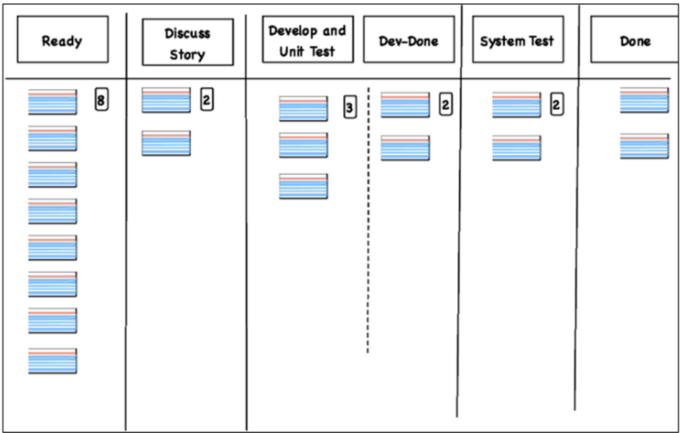

# Assignment 03

- [Assignment 03](#assignment-03)
  - [Question 01: A team completed 5 user stories in 3, 4, 3, 4, 2 days, respectively. The average cycle time is](#question-01-a-team-completed-5-user-stories-in-3-4-3-4-2-days-respectively-the-average-cycle-time-is)
  - [Question 02: A team uses a flow-based agile approach.  Given a project has 15 stories and the team's average cycle time is 3 days per story, the team needs a total of](#question-02-a-team-uses-a-flow-based-agile-approach--given-a-project-has-15-stories-and-the-teams-average-cycle-time-is-3-days-per-story-the-team-needs-a-total-of)
  - [Question 03](#question-03)
  - [Question 04](#question-04)
  - [Relative Weighting Method](#relative-weighting-method)
    - [Question 05: For Feature 1](#question-05-for-feature-1)
    - [Question 06: For Feature 2](#question-06-for-feature-2)
    - [Question 07: For Feature 3](#question-07-for-feature-3)
    - [Question 08](#question-08)
  - [Question 09: Shortest work first is the best feature ranking strategy](#question-09-shortest-work-first-is-the-best-feature-ranking-strategy)
  - [Question 10: Non-functional features have higher value than functional features](#question-10-non-functional-features-have-higher-value-than-functional-features)
  - [Question 11: If a team's Kanban board has these columns, "analysis", "design", "dev", and "tests", it indicates that the team is using waterfall approach](#question-11-if-a-teams-kanban-board-has-these-columns-analysis-design-dev-and-tests-it-indicates-that-the-team-is-using-waterfall-approach)
  - [Question 12: A feature's value often changes over time](#question-12-a-features-value-often-changes-over-time)
  - [Question 13: Each card in a task board represents a user story](#question-13-each-card-in-a-task-board-represents-a-user-story)
  - [Question 14: An agile team should use all the diagrams and charts presented in the textbook to effectively communicate project progress](#question-14-an-agile-team-should-use-all-the-diagrams-and-charts-presented-in-the-textbook-to-effectively-communicate-project-progress)
  - [Question 15: Earned value management is a traditional project management method](#question-15-earned-value-management-is-a-traditional-project-management-method)
  - [Question 16: The best way to estimate velocity is](#question-16-the-best-way-to-estimate-velocity-is)
  - [Question 17: Given the above Kanban board, at the current state a team can](#question-17-given-the-above-kanban-board-at-the-current-state-a-team-can)
  - [Question 18: According to Kano Model, a plan should](#question-18-according-to-kano-model-a-plan-should)
  - [Question 19: What data does a Cumulative Flow Diagram show?](#question-19-what-data-does-a-cumulative-flow-diagram-show)
  - [Question 20: Select each financial measurement](#question-20-select-each-financial-measurement)
  - [Question 21: Select each chart that shows in-progress stories / features](#question-21-select-each-chart-that-shows-in-progress-stories--features)

## Question 01: A team completed 5 user stories in 3, 4, 3, 4, 2 days, respectively. The average cycle time is

Round up your result with one decimal point.

>A team completed 5 user stories in 3, 4, 3, 4, 2 days, respectively.
>The average cycle time is `3.2`.

## Question 02: A team uses a flow-based agile approach.  Given a project has 15 stories and the team's average cycle time is 3 days per story, the team needs a total of

>A team uses a flow-based agile approach.  Given a project has 15 stories and
>the team's average cycle time is 3 days per story, the team needs a total of
>`45` days to finish the project.

## Question 03

Given the average-case and worst-case estimates for 10 user stories,
(3, 13), (2, 2), (2, 13), (1, 8), (2, 5), (2, 2), (1, 2), (3, 13), (1, 8), (1, 13),
use the two schedule buffer approaches discussed on slides 34-35 in Module 5,
answer the following questions.  For buffer size, project total, and number of
iterations, round up your answer to a whole number.
Assuming the team's average velocity is 10.

>Using approach 1, the buffer size is `24`, the project total is `42`, and
>the number of iterations is `5`. Using approach 2, the buffer size is `9`,
>the project total is `27`, and the number of iterations is `3`.

## Question 04

User 1 : (Like, Dislike), User 2 : (Expect, Dislike), User 3 : (Like, Dislike), User 4 : (Like, Dislike), User 5 : (Like, Dislike),

User 6 : (Expect, Dislike), User 7 : (Expect, Dislike), User 8 : (Expect, Dislike), User 9 : (Expect, Dislike), User 10: (Like, Dislike)

The above data shows  Kano model survey responses for a feature, where User id: (a1, a2)
represents answers to functional and dysfunctional questions from the user with that id.
For example, User 1: (Like, Dislike) means the user with id 1 answered "Like"
for functional question and "Dislike" for dysfunctional question.

Use the method discussed on slides 8-10 in Module 6, provide the distribution
of the results and round up each percentage number to a whole number

>M is `20`, L is `10`, E is `40`, R is `0`, Q is `0`, and I is `30`.
>The feature is in the `Exciter` category.

## Relative Weighting Method

| Feature   | Relative Benefit | Relative Penalty | Total Value | Value % | Estimate | Cost % | Priority |
| :-------- | :--------------- | :--------------- | :---------- | :------ | :------- | :----- | :------- |
| Feature 1 | 6                | 2                |             |         | 40       |        |          |
| Feature 2 | 7                | 5                |             |         | 8        |        |          |
| Feature 3 | 6                | 1                |             |         | 9        |        |          |
| **Total** |                  |                  |             | 100     |          | 100    |          |

Use the Relative Weighting method to provide the missing data in the above table. For Value%, Cost%,and Priority, round the value with 2 decimal points. For instance, 2.515 should be rounded to 2.52, and 2.514 should be rounded to 2.51.

### Question 05: For Feature 1

For Feature 1

>total value is `8`,
>Value % is `29.63`,
>Cost % is `70.18`,
>and Priority is `0.42`.

### Question 06: For Feature 2

For Feature 2

>total value is `12`,
>Value % is `44.44`,
>Cost % is `14.04`,
>and Priority is `3.17`.

### Question 07: For Feature 3

For Feature 3

>total value is `7`,
>Value % is `25.94`,
>Cost % is `___`,
>and Priority is `1.64`.

### Question 08

>Feature 1 -> `3`
>
>Feature 2 -> `1`
>
>Feature 3 -> `2`

## Question 09: Shortest work first is the best feature ranking strategy

Shortest work first is the best feature ranking strategy.

>- [x] False

## Question 10: Non-functional features have higher value than functional features

Non-functional features have higher value than functional features.

>- [x] False

## Question 11: If a team's Kanban board has these columns, "analysis", "design", "dev", and "tests", it indicates that the team is using waterfall approach

If a team's Kanban board has these columns, "analysis", "design", "dev", and
"tests", it indicates that the team is using waterfall approach.

>- [x] True

## Question 12: A feature's value often changes over time

A feature's value often changes over time.

>- [x] True

## Question 13: Each card in a task board represents a user story

Each card in a task board represents a user story.

>- [x] False

## Question 14: An agile team should use all the diagrams and charts presented in the textbook to effectively communicate project progress

An agile team should use all the diagrams and charts presented in the textbook
to effectively communicate project progress.

>- [x] False

## Question 15: Earned value management is a traditional project management method

Earned value management is a traditional project management method.

>- [x] True

## Question 16: The best way to estimate velocity is

The best way to estimate velocity is

- [ ] to make a forecast based on public data
- [ ] to run a couple of iterations
- [ ] None of those
>
>- [x] to use historical data

## Question 17: Given the above Kanban board, at the current state a team can

Given the above Kanban board, at the current state a team can

- [ ] move one item from "Develop and Unit Test" to "Dev-Done.
- [ ] move one item from "Discuss Story" to "Develop and Unit Test".
- [ ] move one item from "Ready" to "Discuss Story".
- [ ] move one item from "Dev-Done" to "System Test".
>
>- [x] move one item from "System Test" to "Done".

## Question 18: According to Kano Model, a plan should

According to Kano Model, a plan should

>- [x] include as many linear features as possible
>
- [ ] include a few linear features if time permits
- [ ] not include any linear features
- [ ] include all linear features

## Question 19: What data does a Cumulative Flow Diagram show?

What data does a Cumulative Flow Diagram show?

>- [x] Average cycle time
>- [x] Work stages
>
- [ ] CD3
>
>- [x] WIP

## Question 20: Select each financial measurement

Select each financial measurement

>- [x] ROI
>
- [ ] FFR
>
>- [x] NPV
>
- [ ] Velocity

## Question 21: Select each chart that shows in-progress stories / features

Select each chart that shows in-progress stories / features.

>- [x] Kanban board
>- [x] Scrum task board
>
- [ ] Defect cumulative flow chart
- [ ] Iteration contents chart
