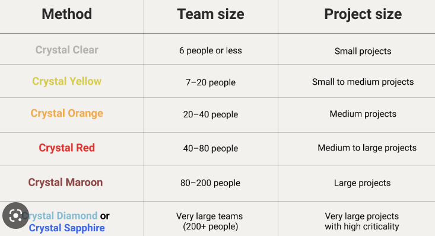
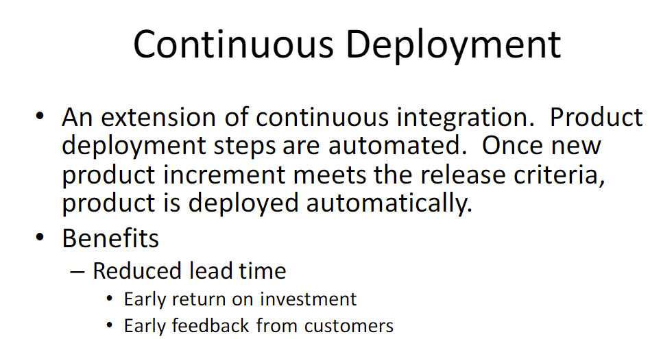
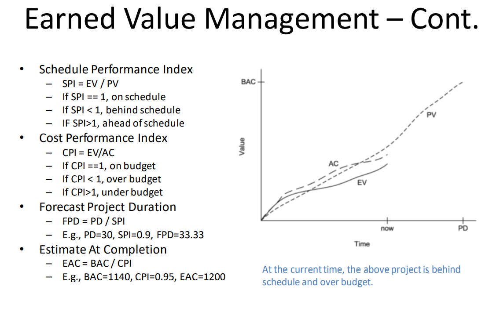

# Assignment 4 Professor's Solution

Correction

For Q17, the article page was moved.  Use this link instead, <https://dzone.com/articles/create-personas-with-the-help-of-the-engineers>

## 01. Customers' top concern of a product is its quality

- [ ] True
- [x] **False**

> Depending on the product stage in life cycle that may change as time
> to market

## 02. If a team practices mobbing, the team's WIP limit is 1

- [x] **True**
- [ ] False

> Work on one story at a time until completed

## 03. Team-based recognition and reward structure encourages team collaboration

- [x] **True**
- [ ] False

> Work as a team and be rewarded as a team

## 04. Crystal clear has more defined roles than Scrum

- [x] **True**
- [ ] False

> <https://www.toolsqa.com/agile/crystal-method/>

## 05. Definition of Ready is used to check if a user story is completed or not

- [ ] True
- [x] **False**

> Definition of `Done` vs `Ready`

## 06. Optimizing individual components of a product is an example of applying system thinking

- [ ] True
- [x] **False**

> System thinking ask one to look at the system as a whole instead of one
> individual component

## 07. With regard to SAFe agile product delivery, development schedule are tied with release schedule

- [ ] True
- [x] **False**

> 

## 08. Kanban requires a team to "walk the board" daily

- [x] **True**
- [ ] False

## 09. A team's scrum of scrums ambassador can change over the time

- [x] **True**
- [ ] False

> Role can change over time

## 10. "Shift performance considerations out of the current story into one or more new stories" is an example of story splitting

- [ ] to remove cross-cutting concerns
- [x] **to separate the functional and nonfunctional aspects**
- [ ] across data boundaries
- [ ] along operational boundaries

## 11. Which role is the servant leader in a SAFe Solution Train?

- [ ] Product management
- [ ] Solution management
- [ ] Solution architect
- [x] **Solution train engineer**

## 12. Crystal clear is best suited for what sized project?  

- [x] **small projects**
- [ ] large projects
- [ ] all projects
- [ ] medium projects

> <https://www.wrike.com/agile-guide/faq/what-is-agile-crystal-methodology/>
> 

## 13. Select the framework used to assess an organization's ability to adopt DevOps

- [ ] ROTI - Is an evaluation metric
- [x] **CALMS**
- [ ] SCAMPI
- [ ] CMMI

## 14. In the Spotify model, which one is similar to a Scrum team?

- [x] **Squad**
- [ ] Tribe
- [ ] Chapter
- [ ] Guild

> Squads
>> Similar to a scrum team, Squads are cross-functional, autonomous teams
>> (typically 6-12 individuals) that focus on one feature area. Each Squad has
>> a unique mission that guides the work they do, an agile coach for support,
>> and a product owner for guidance. Squads determine which agile
>> methodology/framework will be used.
> <https://www.atlassian.com/agile/agile-at-scale/spotify>

## 15. Select each required XP practices

- [x] **Sustainable pace**
- [x] **Pair programming**
- [ ] Behavior-Driven Development
- [ ] Personas

## 16. Select each practice used by DevOps

- [ ] Shift right
- [x] **Shift left**
- [ ] Lean Portfolio Management
- [x] **Infrastructure as code**

## 17. Select true statement according to this [article](https://www.agilealliance.org/create-personas-with-the-help-of-the-engineers/)

For Q17, the article page was moved.

*Use this link instead*: <https://dzone.com/articles/create-personas-with-the-help-of-the-engineers>

- [ ] Every product can benefit from using personas.
- [x] **A persona often changes over the life-span of the product.**
- [x] **Creating personas require upfront market research and analysis.**
- [ ] A product can have multiple personas

## 18. Select item applies to continuous deployment

- [x] **It reduces lead time**
- [ ] It reduces WIP
- [x] **It enables early return on investment**
- [ ] It requires using Git

## 19. Select each item that applies to refactoring

- [ ] It is used to fix production defect.
- [x] **It can improve the maintainability of the code.**
- [ ] It is used to improve the product's user interface.
- [x] **It would not work well without automated regression testing.**

## 20. How can upper managers help agile teams?

- [ ] They can resolve conflicts within agile team
- [ ] They can prioritize product backlog items
- [x] **They can resolve cross organization issues**
- [x] **They can change reward structure to encourage collaboration**

## 21.Select each method that can be used to scale agile

- [x] **Scrum of Scrums**
- [ ] Extreme Programming
- [x] **Spotify model**
- [x] **SAFe**

## 22. Select each iteration-based agile method

- [x] **DSDM**
- [ ] DevOps
- [x] **Crystal Clear**
- [ ] Kanban

## 23. Select each item applies to Acceptance Test-Driven Development

- [x] **It recommends using the Three Amigos approach to write acceptance tests**
- [x] **It requires writing acceptance tests before implementing the features**
- [x] **It often uses Given-When-Then template**
- [x] **It is an extension of TDD**

## Earned Value Management

EV = 55, PV = 60, AC = 59, PD = 10, BAC = 1000

Given the above data at time t, answer the following questions using the Earned
Value Management method discussed in class.

### 24. At time t, the project is

- [ ] on schedule
- [ ] ahead of schedule
- [x] **behind schedule**

> PV/EV > 1

### 25. At time t, the project is

- [ ] on budget
- [x] **over budget**
- [ ] under budget

> EV/PV: less than (<) 1 is over-budget, greater than (>) 1 is under-budget,
> and is equal to (=) 1 is on-budget
